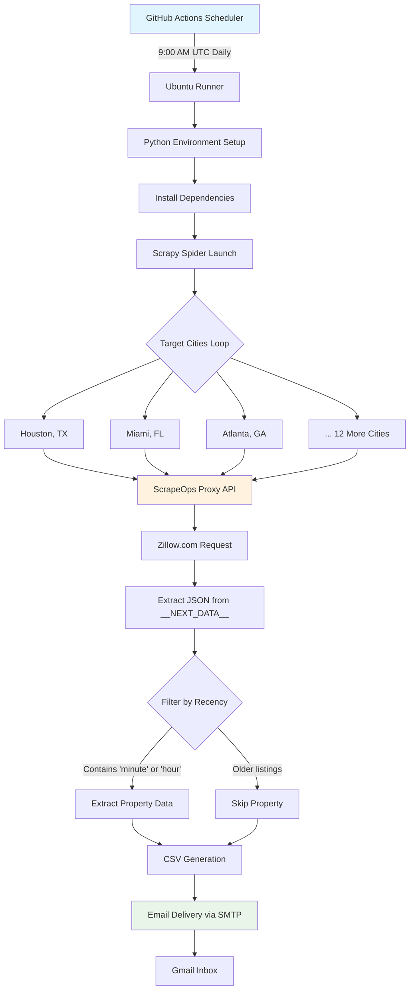
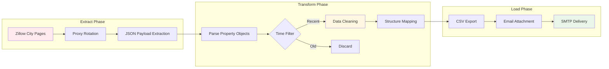
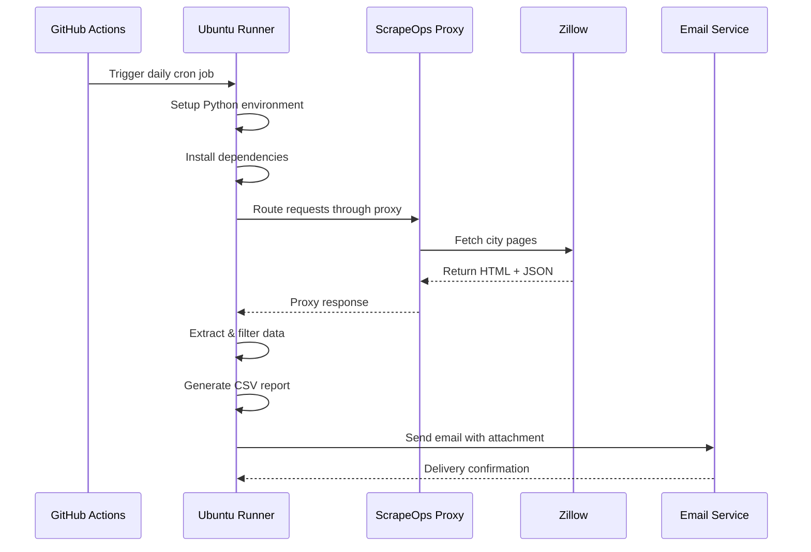

# 🏠 Real Estate Flash Leads Scraper

> **Automated ETL Pipeline for Real-Time Property Intelligence**

A serverless, cloud-native real estate data pipeline that monitors 15 major US housing markets for newly listed properties and delivers actionable insights via automated email reports.

## 🎯 What It Does

This system automatically identifies "flash leads" - properties that have been on the market for just minutes or hours - across major metropolitan areas. It bypasses anti-bot protections, processes raw JSON data, and delivers clean CSV reports to your inbox every morning at 9 AM UTC.

## 🏗️ System Architecture



## 🔄 Data Flow Pipeline



## 🛠️ Technology Stack

| Component | Technology | Purpose |
|-----------|------------|---------|
| **Web Scraping** | Scrapy 2.14+ | High-performance data extraction |
| **Proxy Management** | ScrapeOps API | IP rotation & anti-bot bypass |
| **Cloud Infrastructure** | GitHub Actions | Serverless automation |
| **Data Processing** | Python 3.11 | ETL logic & transformations |
| **Email Delivery** | SMTP (Gmail) | Automated report distribution |
| **Data Format** | CSV | Structured output for analysis |

## 🎯 Target Markets

The scraper monitors these high-volume real estate markets:

**Texas Markets** (4 cities)
- Houston, Dallas, Austin, San Antonio

**Florida Markets** (4 cities)  
- Miami, Orlando, Tampa, Jacksonville

**Sunbelt & Growth Markets** (7 cities)
- Atlanta, Charlotte, Raleigh, Nashville, Phoenix, Las Vegas, Denver

## 📊 Data Schema

Each property record contains:

```json
{
  "id": "12345678",
  "price": 450000,
  "address": "123 Main St, Houston, TX 77001",
  "time_on_market": "2 minutes ago",
  "url": "https://zillow.com/homedetails/..."
}
```

## 🚀 Quick Start

### Prerequisites
- Python 3.11+
- ScrapeOps API key
- Gmail account with App Password

### Local Development

1. **Clone & Setup**
```bash
git clone https://github.com/YOUR-USERNAME/real-estate-scraper.git
cd real-estate-scraper
python -m venv .venv
source .venv/Scripts/activate  # Windows
pip install -r requirements.txt
```

2. **Configure API Keys**
```python
# In real_estate_scraper/spiders/zillow.py
payload = {
    "api_key": "YOUR_SCRAPEOPS_API_KEY",
    "url": url
}
```

3. **Set Email Credentials**
```python
# In send_email.py
SENDER_EMAIL = "your-email@gmail.com"
RECEIVER_EMAIL = "recipient@gmail.com"
```

4. **Run Pipeline**
```bash
# Extract data
scrapy crawl zillow -O todays_leads.csv

# Send email report
export EMAIL_PASSWORD="your_gmail_app_password"
python send_email.py
```

## ☁️ Cloud Deployment

### GitHub Actions Setup

1. **Add Repository Secret**
   - Go to Settings → Secrets and variables → Actions
   - Add `EMAIL_PASSWORD` with your Gmail App Password

2. **Automatic Execution**
   - Runs daily at 9:00 AM UTC
   - Manual trigger available via Actions tab

### Workflow Process



## 🔧 Configuration Options

### Spider Settings
```python
# real_estate_scraper/settings.py
CONCURRENT_REQUESTS_PER_DOMAIN = 1  # Respectful crawling
DOWNLOAD_DELAY = 1                  # Rate limiting
RETRY_TIMES = 5                     # Error handling
DOWNLOAD_TIMEOUT = 120              # Request timeout
```

### Email Customization
```python
# send_email.py
def send_leads():
    # Customize subject line
    msg['Subject'] = f"🚨 {lead_count} New Flash Leads"
    
    # Modify email body
    msg.set_content(f"Found {lead_count} new properties...")
```

## 📈 Performance Metrics

- **Coverage**: 15 major US markets
- **Frequency**: Daily automated runs
- **Speed**: ~2-3 minutes per city
- **Accuracy**: JSON-based extraction (no HTML parsing)
- **Reliability**: Proxy rotation prevents blocking

## 🛡️ Anti-Bot Evasion

The system employs several techniques to bypass detection:

1. **Residential Proxy Rotation** via ScrapeOps
2. **JSON Payload Extraction** (bypasses HTML parsing)
3. **Respectful Rate Limiting** (1 req/sec per domain)
4. **User-Agent Rotation** (handled by proxy service)

## 📧 Email Report Format

Daily reports include:
- **Subject**: Lead count and urgency indicator
- **Body**: Summary with key metrics
- **Attachment**: Complete CSV with all properties
- **Delivery**: Reliable SMTP via Gmail

## ⚠️ Important Notes

- **Educational Purpose**: Built for learning ETL architecture and cloud automation
- **Rate Limiting**: Configured for respectful crawling
- **Terms of Service**: Review target site policies before scaling
- **Data Accuracy**: Flash leads are time-sensitive and may change rapidly

## 🤝 Contributing

1. Fork the repository
2. Create a feature branch
3. Make your changes
4. Test locally
5. Submit a pull request

## 📄 License

This project is for educational and portfolio purposes. Please respect website terms of service and use responsibly.

---

**Ready to deploy?** Add your API keys, configure the email settings, and let the automation handle the rest. Your daily real estate intelligence reports will start flowing automatically.